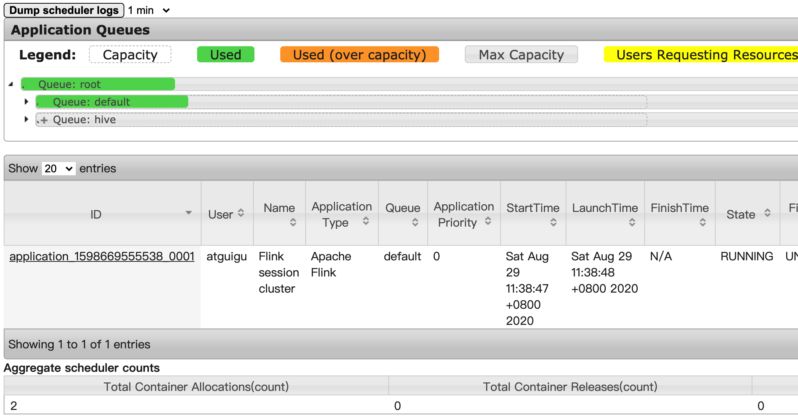
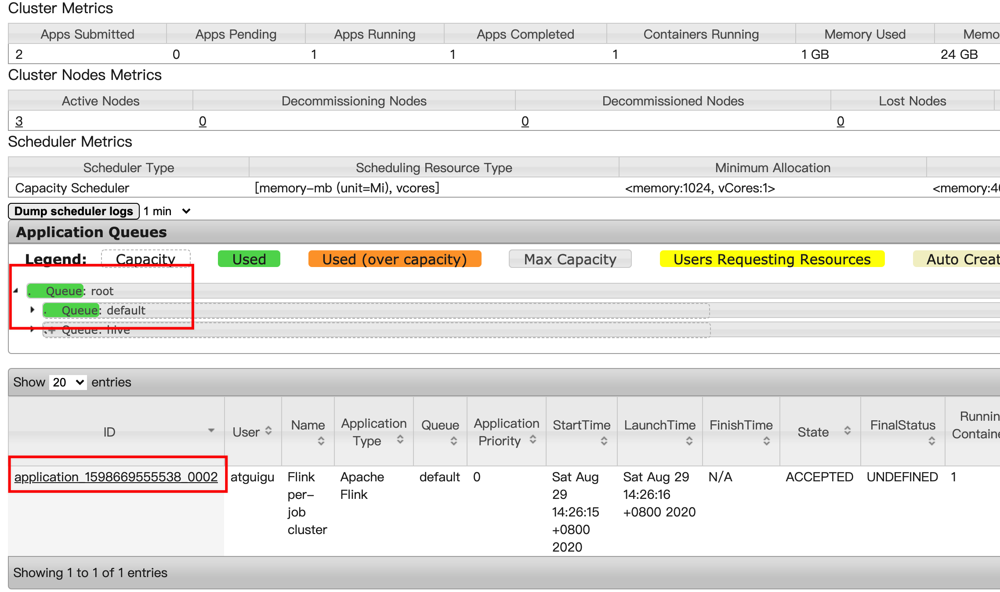

# Flink on Yarn 部署

## 通用配置

步骤 1, 将 `flink-1.10.2-bin-scala_2.12.tgz` 解压到相关目录:

```bash
[atguigu@hadoop102 flink]$ ll
总用量 274056
-rw-r--r--. 1 atguigu atguigu 280626150 8月  29 10:27 flink-1.10.1-bin-scala_2.12.tgz
[atguigu@hadoop102 flink]$ pwd
/opt/software/flink
[atguigu@hadoop102 flink]$ tar -zxvf flink-1.10.1-bin-scala_2.12.tgz -C /opt/module/
```

## Session-cluster

步骤 1, 启动 Hadoop 集群:

```bash
[atguigu@hadoop102 bin]$ mycluster start
```

步骤 2, 启动 yarn-session:

```bash
[atguigu@hadoop102 bin]$./yarn-session.sh -n 2 -s 2 -jm 1024 -tm 1024 -nm test -d
```

其中:

```
-n(--container)	TaskManager 的数量. 这个参数已经被废止了, 因为不能这样限定. 一开始不分配 TaskManager, 按需分配, 来一个任务需要多少, 就分配多少.
-s(--slots)		每个 TaskManager 的 slot 数量, 默认一个 slot 一个 core, 默认每个 taskmanager 的 slot 的个数为 1, 有时可以多一些 taskmanager，做冗余.
-jm				JobManager 的内存 (单位 MB). 
-tm				每个 taskmanager 的内存 (单位 MB).
-nm				yarn 的 appName (现在 yarn 的 ui 上的名字).
-d				后台执行. detached mode.
```

步骤 3, 确认当前 jps 进程:

```bash
[atguigu@hadoop102 module]$ myjps
=============== jps Haoop102 ===============
71763 NodeManager
71923 JobHistoryServer
75893 YarnSessionClusterEntrypoint
71333 NameNode
71465 DataNode
75736 FlinkYarnSessionCli
77789 Jps
=============== jps Haoop103 ===============
9953 NodeManager
9635 DataNode
11706 Jps
9820 ResourceManager
11598 YarnTaskExecutorRunner
=============== jps Haoop104 ===============
8752 DataNode
8835 SecondaryNameNode
10292 Jps
8921 NodeManager
```

步骤 4, Web 端访问:

**JobManager Web Interface**: http://hadoop102:42681

**Yarn RM Web Interface**: http://hadoop102:8088



步骤 5, 关闭 yarn-session:

```bash
[atguigu@hadoop102 module]$ yarn application --kill application_1598669555538_0001
```

## Per Job Cluster

步骤 1, 启动 Hadoop 集群:

```bash
[atguigu@hadoop102 bin]$ mycluster start
```

步骤 2, 将打好的 jar 包放入 `examples/` 中:

```bash
[atguigu@hadoop102 examples]$ pwd
/opt/module/flink-1.10.2/examples
[atguigu@hadoop102 examples]$ ll
总用量 61772
drwxr-xr-x. 2 atguigu atguigu     4096 8月  17 17:56 batch
-rw-r--r--. 1 atguigu atguigu 63230131 8月  29 14:13 FlinkTutorial-1.0-SNAPSHOT-jar-with-dependencies.jar
drwxr-xr-x. 2 atguigu atguigu     4096 8月  17 17:56 gelly
drwxr-xr-x. 3 atguigu atguigu     4096 8月  17 17:56 python
drwxr-xr-x. 2 atguigu atguigu     4096 8月  17 17:56 streaming
drwxr-xr-x. 2 atguigu atguigu     4096 8月  17 17:56 table
```

步骤 3, 不启动 yarn-session，直接执行 job:

```bash
[atguigu@hadoop102 flink-1.10.1]$ bin/flink run -m yarn-cluster -c com.atguigu.wc.StreamWordCount examples/FlinkTutorial-1.0-SNAPSHOT-jar-with-dependencies.jar --host localhost --port 7777
```

步骤 4, 在 RM 的 Web UI http://hadoop103:8088/ 查看 Job 信息:



步骤 5, 关闭 yarn-session:

```bash
[atguigu@hadoop102 module]$ yarn application --kill application_1598669555538_0002
```

