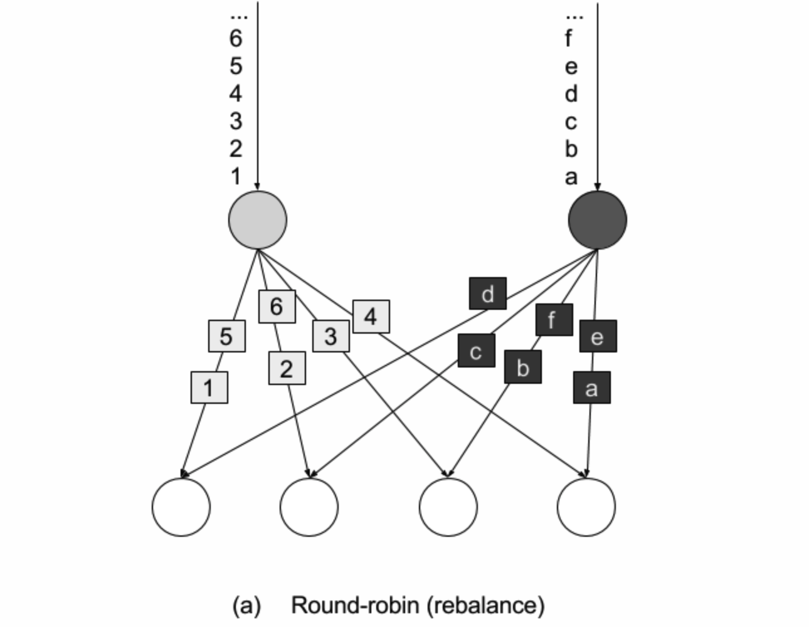
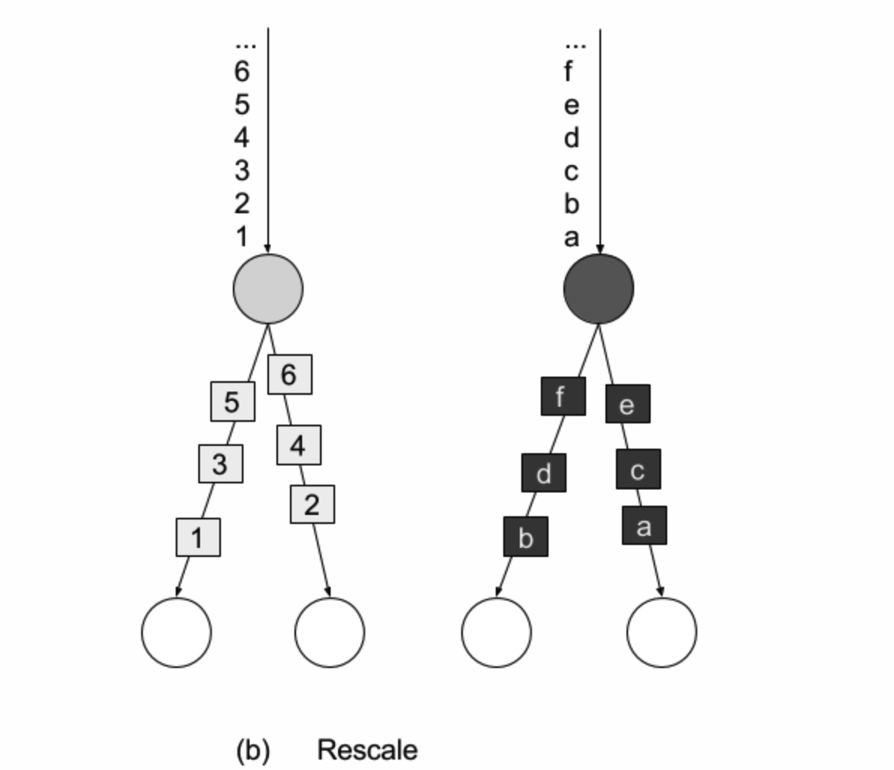
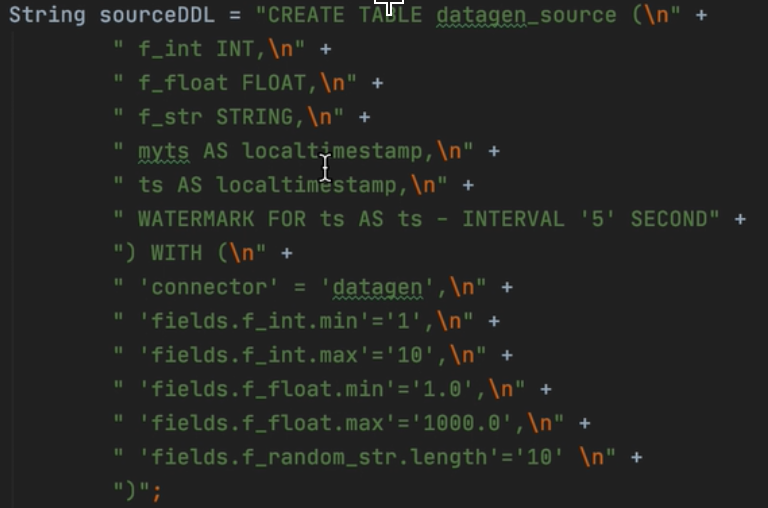

# Flink Learning

一般而言, 学习 Flink 基础时, 可以按照以下的层次去学习: 

- Architechture
- 时间语义与 Watermark
- 状态编程, 容错机制, 状态一致性
- 分层 API

以上的思维导图 → [Flink Summary](./FlinkSummary.xmind)

技术与业务结合 → [Flink 在实时场景中的应用](Flink实时应用场景.xmind)

下面便是上面这四部分的延伸, 以及一些其他方面的扩展, 之后会不断更新:  


## 待整理

- [ ] Flink 类加载与双亲委派机制


## API

### rebalance & rescale

random 方法将数据根据均匀分布随机讲数据分布到下一个任务. 

rebalance 方法以 round-robin 的方式将数据依次发送给下一个任务.

rescale 和 rebalance 类似, 也可以将数据以 round-robin 的方式发送给下游任务, 不同点是 rebalance 会将数据发送发送给所有下游任务，而 rescale 只将数据发送给部分下游任务：






[Flink 学习笔记之三 DataStream API](https://xieyuanpeng.com/2019/02/05/flink-learning-3/#round-robin)


## Architecture

### Flink 运行时组件

**JobManager**

调度: JobGraph → ExecutionGraph

向 RM 申请资源 -- `slot` 

Checkpoint 的协调调度.

**TaskManager**

具体干活的. 有时候也叫 worker.

一个 TM 可以包含多个 `slot`, 能够并行执行任务的 (静态的) 能力.

**ResourceManager**

提交任务, 分配任务和资源 ( `slot` ) 时, 比较重要.

**Dispacher**

启动应用.

REST 接口.

Web UI


## 时间语义

### Watermark

AllowedLateness 中的数据, 是迟于 WindowEnd 的, 一般 timer 是 WindowEnd + 1, 那么这些数据注册的 Timer 是已经过了的, 这时, 只要再来 WaterMark, 就会触发定时的事件. 

延迟一般分为网络传输和集群内分布式计算的延迟, 一般是正态分布, 根据 3 sigma 原则, 其实 3 sigma 就能 cover 绝大多数的迟到数据. 这里就有两种处理方式: 

1. 不用 3 sigma 原则. 设定较长的 Watermark 延迟. 比如这个里面, window 10min, 5s 输出一次, 但如果设定 Watermark delay 为 1min, 那么延迟计算会很久, 是不适合的. 
2. 所以更好的做法是 Watermark 设定小一些, 但设定一个较长的 allowedLateness, 这样能快速计算看到结果,     结果也会在后续的 allowedLateness 时间段内不断更新进行修正. 

所以, 乱序数据延迟较大, 输出频率较低, 准确性要求比较高的情况, 最好使用 allowedLateness. 这种情况下, Flink SQL 就不适合了. 

但如果本身输出频率没那么快, 延迟较小比较集中, 准确性要求一般, 那么直接使用稍大的 Watermark 并使用 Flink SQL 进行开发会简单很多. 

再迟的数据就放入侧输出流, 因为是最晚的. 

### AllowedLateness

在 Flink 时间语义与窗口结合中, 我们经常会有需要去解决乱序数据和迟到数据, Watermark 可以包容一部分乱序数据, 我们仍可以通过设置 AllowedLateness 来让窗口再等待乱序数据一段时间, 但再迟于这个界限的数据就会被丢弃或流入侧输出流中. 

详细阐述见下文链接: 

[AllowedLateness](./AllowedLateness.md)


## Flink SQL

### 基础

[Apache Flink 进阶（十二）：深度探索 Flink SQL](https://zhuanlan.zhihu.com/p/124267320), 可以结合 Flink 版本特性查看 SQL 各个版本的优化. 

My Blog Article →[FlinkStreamingSQL深度篇](http://zhangchao.top/2020/06/02/FlinkStreamingSQL%E6%B7%B1%E5%BA%A6%E7%AF%87/)

孙金武所讲的课程中的 Flink SQL 也值得反复学习 → [B 站视频](https://www.bilibili.com/video/BV1yk4y1z7Lr?p=44)

### Temporal Table Join 维表关联

[实时数仓|Flink SQL之维表join](https://mp.weixin.qq.com/s?__biz=MzI0NTIxNzE1Ng==&mid=2651220208&idx=1&sn=ebd800ef48913d6f189b75456ec13d2d&chksm=f2a32a1bc5d4a30de38313530dfdb7660dba9fd89b9249e26b2416cc52778076329e76dbfcd4&mpshare=1&scene=1&srcid=1107gA0QztbMC1nTYgVsmfLX&sharer_sharetime=1604749059647&sharer_shareid=3e4a6d38b1252bc10eeab6b451c24d0e#rd)

[Apache Flink 漫谈系列(11) - Temporal Table JOIN](https://developer.aliyun.com/article/679659)

[Flink CookBook-Table&Sql | 维表Join原理解析](https://www.jianshu.com/p/189945244f79)


## Flink 源码

源码阅读也是学习框架的重要一环, 目前在这个文件中记录了一部分源码学习的内容: 

[Flink 源码学习](Flink源码阅读_temp.txt)


## Flink 监控

### 反压机制

https://juejin.im/post/6844903955831455752

- Flink 流处理为什么需要网络流控？
- Flink V1.5 版之前网络流控介绍
- Flink V1.5 版之前的反压策略存在的问题
- Credit的反压策略实现原理，Credit是如何解决 Flink 1.5 之前的问题？
- 对比spark，都说flink延迟低，来一条处理一条，真是这样吗？其实Flink内部也有Buffer机制，Buffer机制具体是如何实现的？
- Flink 如何在吞吐量和延迟之间做权衡？

**待解决的问题?** 

- [如何分析及处理 Flink 反压？ !!!! 原因, 数据倾斜等](https://developer.aliyun.com/article/727389)

  反压的影响
  反压并不会直接影响作业的可用性，它表明作业处于亚健康的状态，有潜在的性能瓶颈并可能导致更大的数据处理延迟。通常来说，对于一些对延迟要求不太高或者数据量比较小的应用来说，反压的影响可能并不明显，然而对于规模比较大的 Flink 作业来说反压可能会导致严重的问题。

  这是因为 Flink 的 checkpoint 机制，反压还会影响到两项指标: checkpoint 时长和 state 大小。

  前者是因为 checkpoint barrier 是不会越过普通数据的，数据处理被阻塞也会导致 checkpoint barrier 流经整个数据管道的时长变长，因而 checkpoint 总体时间（End to End Duration）变长。
  后者是因为为保证 EOS（Exactly-Once-Semantics，准确一次），对于有两个以上输入管道的 Operator，checkpoint barrier 需要对齐（Alignment），接受到较快的输入管道的 barrier 后，它后面数据会被缓存起来但不处理，直到较慢的输入管道的 barrier 也到达，这些被缓存的数据会被放到state 里面，导致 checkpoint 变大。
  这两个影响对于生产环境的作业来说是十分危险的，因为 checkpoint 是保证数据一致性的关键，checkpoint 时间变长有可能导致 checkpoint 超时失败，而 state 大小同样可能拖慢 checkpoint 甚至导致 OOM （使用 Heap-based StateBackend）或者物理内存使用超出容器资源（使用 RocksDBStateBackend）的稳定性问题。

  因此，我们在生产中要尽量避免出现反压的情况（顺带一提，为了缓解反压给 checkpoint 造成的压力，社区提出了 FLIP-76: Unaligned Checkpoints[4] 来解耦反压和 checkpoint）。

- 京东 flink 优化. 反压量化

- 基于 Flink 的流控机制和反压如何定位 Flink 任务的瓶颈。或者说，如果一个平时正常的 Flink 任务突然出现延迟了，怎么来定位问题？到底是 Kafka 读取数据慢，还是中间某个计算环节比较消耗资源使得变慢，还是由于最后的写入外部存储时比较慢？

### Flink Metrics

https://juejin.im/post/6844904002027520014

- 什么是 Metrics?
- Metric Types
- Metric Group
- 如何使用 Metrics？
- System Metrics
- User-defined Metrics
- User-defined Metrics Example
- 获取 Metrics
- Metric Reporter
- 实战：利用 Metrics 监控
- 自动化运维
- 性能分析
- 实战：“我的任务慢，怎么办”
- 发现问题
- 缩小范围，定位瓶颈
- 多维度分析

### Flink定位SubTask在哪台机器哪个进程执行

https://juejin.im/post/6844903957354151950


## Flink 优化

### 任务调度的扩展

`.slotSharingGroup(str : String)` 插槽共享组

如果设了一个操作共享组为 1, 其后都同属于这个共享组, 直到下一个共享组出现; 同一个共享组的计算能够共享一个 slot, 跨足之间不能共享, 只有组内可以.

默认给了一个 `default` 的共享组, 所以想分开不能叫这个名.
同时, 任务调度中不同的 SlotSharingGroup 是不能合并 (同并行度和无 shuffle) 的.

```java
val inputDataStream: DataStream[String] = env.socketTextStream(host, post)

    // compute
    val resultDataStream: DataStream[(String, Int)] = inputDataStream
      .flatMap(_.split(" ")).setParallelism(2)
      .filter(_.nonEmpty).slotSharingGroup("1")
      .map((_, 1))
      .keyBy(0)
      .sum(1)

    // print
    resultDataStream.print()
```

这段代码如果默认并行度为 2, 则 "1" 之前用 2 个, "1" 及之后也用两个, 但因为在不同共享组, 所以总共用 4 个.

如果不想某算子与其他算子之间合并, 对此算子启用 `Operator.disableChaining`, 也可以 `env.diableOperatorChainning` 进行全局算子不合并.

如果想从某算子开始一个新的任务链, 则从调用该算子的 `Operator.startNewChain`, 以上用以对项目进行性能优化.


## Flink 版本特性

### 1.9

[即将发版！Apache Flink 1.9 有哪些新特性](https://zhuanlan.zhihu.com/p/76503670)

[Apache Flink 1.9重磅发布：正式合并阿里内部版本Blink重要功能](https://www.infoq.cn/article/9fIfUDU_qsCCGdODMApO)

### 1.10

[Apache Flink 1.10.0 重磅发布，年度最大规模版本升级！](https://developer.aliyun.com/article/744734)

[Flink 1.10 SQL、HiveCatalog与事件时间整合示例](https://blog.csdn.net/nazeniwaresakini/article/details/105114921)

### 1.11

[官宣 | 千呼万唤，Apache Flink 1.11.0 正式发布啦！](https://zhuanlan.zhihu.com/p/158093064)

[重磅！Apache Flink 1.11 功能前瞻抢先看！](https://developer.aliyun.com/article/762501)

[Flink 1.11 Release 文档解读](https://cloud.tencent.com/developer/article/1654541)

[Flink SQL 1.11 新功能与最佳实践](https://mp.weixin.qq.com/s?spm=a2c6h.12873639.0.0.308c7f39peds08&__biz=MzU3Mzg4OTMyNQ==&mid=2247489141&idx=1&sn=e7e190ffa04b4111532756785a72d3b8&chksm=fd3b9837ca4c1121bc4827895bd24c2aa6a1cca586096fc3915a6a7ae8d06c8172496aa49599&token=1469353217&lang=zh_CN#rd)

[深度解读：Flink 1.11 SQL流批一体的增强与完善](https://cloud.tencent.com/developer/news/661653)


## Flink 生产

[Flink on Yarn 的部署](./FlinkOnYarnDeployment.md)


## Flink 处理业务中的问题

### 维表关联 Join

My Blog Article → [Flink维度关联的几种思路](http://zhangchao.top/2020/11/03/Flink%E7%BB%B4%E5%BA%A6%E5%85%B3%E8%81%94%E7%9A%84%E5%87%A0%E7%A7%8D%E6%80%9D%E8%B7%AF/)

Flink SQL 中的 Temporal Table Join

### 去重使用 BloomFilter

[BloomFilter](./BloomFilter.md)

### SQL 开窗时间字段的问题




问题：Window aggregate 要定义在时间属性上，但其实 myts 也是一个时间属性，后来发现 window 的时间字段需要是一个 Time Attribute 这样一个属性类型，flink 如何生成 Time Attribute： 

- processing time 计算列
- 或者有一个 ts 的 timestamp 的字段，然后使用 `watermark for ts as ts - interval '1' second`吗，这个过程把 ts 变成一个时间属性。

## Flink 项目

我的仓库 → [基于 Flink 的用户行为分析](https://github.com/agoclover/flink-project-UserBehaviorAnalysis)

电商常用数据指标 → [指标](./电商数据指标.xmind)

## Flink 实时数仓

目前大厂都基于 Flink, Kafka 等构建了实时数仓或准实时数仓, 以下是一些实践的记录: 

[基于Flink的实时数仓](./基于Flink的实时数仓.md)


## Flink 学习资源

[基础学习](https://www.bilibili.com/video/BV1Qp4y1Y7YN?from=search&seid=5623280270066384482)

[进阶学习](https://www.bilibili.com/video/BV1yk4y1z7Lr?p=1)

[Chrome 收藏夹](./bookmarks_2020_11_8.html)